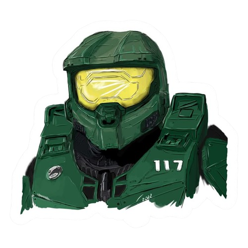

  

<h1 align="center">Trabajo Práctico N°4 - Laboratorio de Programación - 2025</h1>
<h3 align="center">Licenciatura en Sistemas - Universidad Nacional de la Patagonia Austral</h3>

---

# 📖 Trabajo Práctico Nº 3: HTML5 & JavaScript

## 📝 Descripción

Este proyecto es el **Trabajo Práctico Nº 3** de la asignatura **Laboratorio de Programación** de las carreras **Licenciatura en Sistemas** y **Analista de Sistemas** de la **Universidad Nacional de la Patagonia Austral**, correspondiente al primer cuatrimestre de 2025. El objetivo es demostrar habilidades en el uso de **HTML5** y **JavaScript** mediante la creación de una página institucional, un currículum vitae digital, un formulario con validaciones y ejercicios de manipulación del DOM y eventos.

## 📂 Estructura del Proyecto

| Archivo/Directorio | Descripción |
|--------------------|-------------|
| 📄 `index.html`    | Página de inicio institucional con diseño responsive. |
| 📄 `index.html`       | Currículum Vitae digital con estructura semántica. |
| 📄 `formulario.html` | Formulario con validaciones HTML5 y JavaScript. |
| 📄 `javascript-ejercicios.html` | Ejercicios prácticos de JavaScript. |
| 🎨 `css/`          | Estilos CSS del proyecto. |
| 🖼️ `img/`         | Imágenes utilizadas en las páginas. |
| ⚙️ `js/`           | Scripts JavaScript del proyecto. |

## 🛠️ Requisitos

- 🌐 Navegador web moderno.
- 📦 No se requieren dependencias externas.

## 💻 Entorno de Desarrollo

- 🖌️ **Editor de Código**: Visual Studio Code (v1.XX.X).
- 🐧 **Sistema Operativo**: openSUSE.
- 💻 **Hardware**: HP Victus D16 Laptop.

## 🚀 Instrucciones de Uso

1. 📥 Cloná el repositorio: `git clone <URL_DEL_REPOSITORIO>`.
2. 📂 Navegá al directorio del proyecto: `cd <NOMBRE_DEL_PROYECTO>`.
3. 🌐 Abrí los archivos HTML (`index.html`, `cv.html`, `formulario.html`, `javascript-ejercicios.html`) en un navegador web.
   - 🔧 **Opcional**: Usá un servidor local (como la extensión **Live Server** de VS Code) para asegurarte que los recursos carguen correctamente.
4. ✅ Verificá que las imágenes y scripts funcionen correctamente.

## 📚 Contenido del Proyecto

### 🌐 1. Página de Inicio Institucional
- Portal institucional con estructura semántica (`header`, `nav`, `section`, `footer`).
- Incluye imágenes, un video (o enlace a YouTube) y diseño responsive.

### 📋 2. Currículum Vitae Digital
- Estructura con datos personales, formación académica, experiencia laboral y otros datos de interés.
- Uso de listas (`<ul>`, `<ol>`, `<dl>`), índices con enlaces y botones "Ir a inicio".
- Imágenes almacenadas en la carpeta `img/`.

### 📋 3. Formulario con Validación
- Campos: Nombre, Patente, Correo, URL, Fecha, Número, Password, Materia favorita (datalist).
- Validaciones HTML5 y método GET.
- Título: "Trabajo Práctico HTML5 - Alumno: Butterfield".

### ⚙️ 4. Ejercicios de JavaScript
1. Formulario con 5 botones que muestran un `alert()` (ejemplo: "Lunes").
2. Concatenación de día y horario en un campo de texto.
3. Cálculo de peso aproximado según altura, edad y sexo.
4. Multiplicación de valores numéricos con resultado en un campo.
5. Agenda de tareas con funciones para agregar y eliminar elementos.

## 👤 Autor

- **Nombre**: Nicolás Butterfield
- **Contacto**: [nicobutter@gmail.com](mailto:nicobutter@gmail.com) | [GitHub](#)

## 📜 Licencia

Este proyecto está bajo la **Licencia MIT**, lo que permite su uso, copia y modificación libremente bajo los términos establecidos. Consulta el archivo `LICENSE` para más detalles.

## 📚 Referencias

- Consigna del Trabajo Práctico Nº 3, Laboratorio de Programación, UNPA.
- Documentación oficial de HTML5 y JavaScript (MDN Web Docs).

---

## 🕹️ Bonus Track

   
  <strong>"We'll make it through this. We always do."</strong> 
  <em>– John-117. Master Chief</em>

